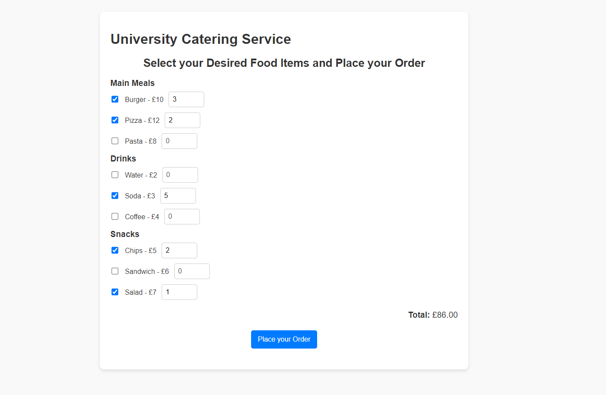
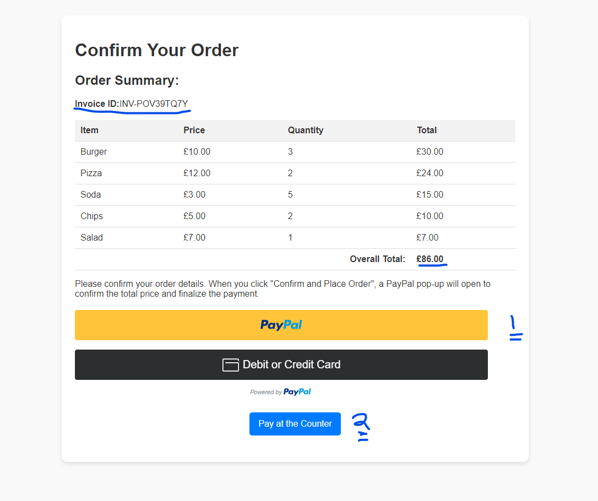
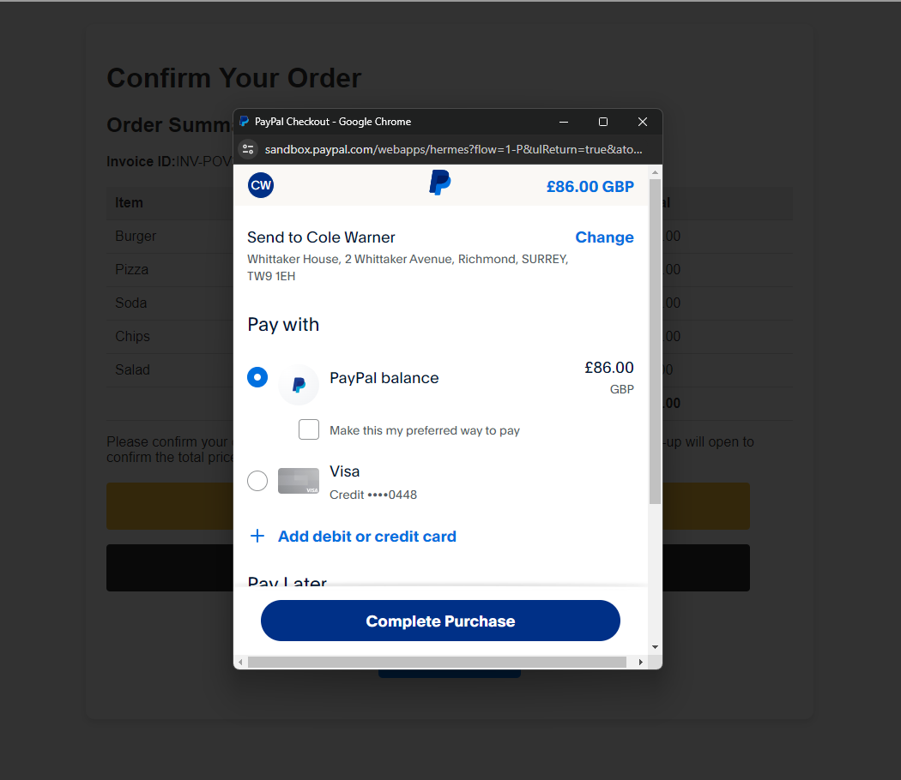
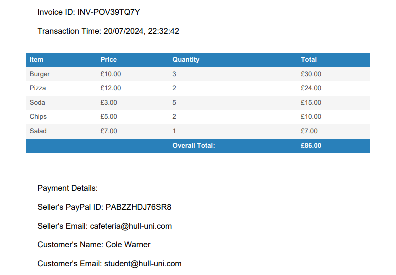

# University Catering Food Ordering Web Component.

## Overview

This University Catering Food Ordering Web Component is a comprehensive system designed for easy meal ordering with two payment options:
- PayPal
- Pay at the Counter

 

## How the App Works

1. **Menu Selection**: Users browse and select food items from categorized menus (Main Meals, Drinks, Snacks).
2. **Order Summary**: The app calculates the total cost in real-time as items are selected.
3. **Order Confirmation**: Users review their order and proceed to payment.
4. **Payment Options**: 
   - PayPal: Integrated secure online payment
   - Pay at Counter: For in-person transactions
5. **Transaction Processing**: The app generates a unique invoice and processes the payment.
6. **Receipt Generation**: A downloadable PDF receipt is created post-transaction.

 

## PayPal Integration

The app uses the PayPal JavaScript SDK for secure payment processing:

- Linked to a sandbox business PayPal account for testing.
- Simulates real PayPal transactions using dummy customer accounts.
- Generates unique invoices for each order.
- Records detailed transaction information including itemized list and pricing.
- Reflects transactions in both customer and business accounts.

 

## Screenshots

### 1. Confirm Order Page.

 

### 2. Payment Page.

 

### 3. Thank You Page.

 

### 4. Generated PDF Receipt.

## Technology Stack

- HTML5
- CSS3
- JavaScript (ES6+)
- PayPal JavaScript SDK
- jsPDF for PDF generation

## Installation and Setup

1. Clone the repository: git clone https://github.com/gitongatonny/PayPal-Integrated-Food-Ordering-Web-Component.git
2. Navigate to the project directory:
3. Open `index.html` in a web browser to start using the application.

## Testing
For testing purposes:

- Use sandbox (dummy) customer accounts to simulate transactions.
- Verify transaction records in the accounts post-payment.
